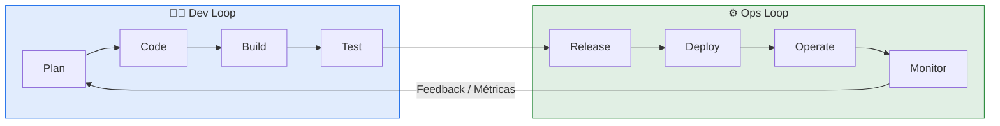
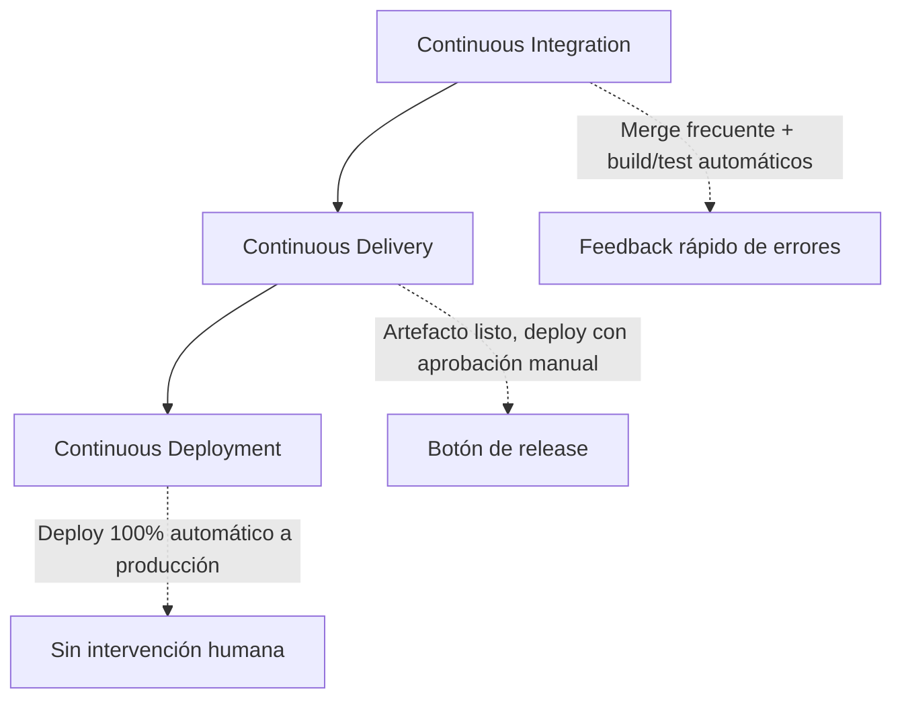
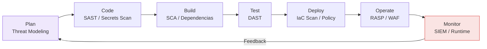

# 📘 Módulo 1 — Fundamentos de DevOps & DevSecOps

> [!NOTE]
> **Fecha:** 2026-07-23
> **Módulo:** 1 — Fundamentos de DevOps & DevSecOps
> **Tags:** `#devops` `#devsecops` `#ci-cd` `#sre` `#multicloud`

---

## 🎯 Summary

DevOps es una **cultura + conjunto de prácticas + herramientas** que unifica el desarrollo (`Dev`) y las operaciones (`Ops`) para acortar el ciclo de vida del software, aumentar la frecuencia de despliegues y mejorar la fiabilidad.

- **¿Qué problema resuelve?:** Elimina los silos entre equipos (Dev vs Ops), reduce el *time-to-market*, disminuye el *lead time* de cambios y minimiza el *change failure rate* mediante automatización y feedback continuo.
- **Casos de Uso Principales:** Automatización de builds/tests/deploys, entrega continua de microservicios, gestión de infraestructura reproducible (IaC), y seguridad integrada (DevSecOps) *shift-left*.

> [!TIP]
> **Mental model:** DevOps NO es un rol ni una herramienta; es un **flujo de valor** medido por las 4 métricas DORA (ver sección 5).

---

## 📐 2. Arquitectura & Flujo — Ciclo de Vida DevOps

El ciclo DevOps se representa como un **bucle infinito (∞)** de 8 fases divididas en dos dominios: *Dev* (izquierda) y *Ops* (derecha), retroalimentándose de forma continua.



| Fase | Dominio | Objetivo | Herramientas típicas |
| :--- | :--- | :--- | :--- |
| **Plan** | Dev | Definir requisitos, backlog | Jira, Azure Boards, GitHub Projects |
| **Code** | Dev | Escribir + versionar código | Git, GitHub, Azure Repos |
| **Build** | Dev | Compilar / empaquetar artefacto | Maven, Docker, Jenkins |
| **Test** | Dev | Validar calidad y seguridad | JUnit, SonarQube, Trivy |
| **Release** | Ops | Preparar versión para producción | Jenkins, GitHub Actions, ArgoCD |
| **Deploy** | Ops | Publicar en el entorno objetivo | Kubernetes, Terraform, Helm |
| **Operate** | Ops | Gestionar la carga en runtime | K8s, Ansible, Systemd |
| **Monitor** | Ops | Observar métricas/logs/traces | Prometheus, Grafana, CloudWatch |

---

## ⚡ 3. Los 3 "Continuos" — CI / CD / CD

> [!IMPORTANT]
> No confundir los tres conceptos. Se construyen uno sobre otro de forma incremental.



| Concepto | ¿Qué automatiza? | ¿Dónde termina? | Gate humano |
| :--- | :--- | :--- | :--- |
| **Continuous Integration (CI)** | Merge + Build + Test + Análisis estático | Artefacto validado en el registry | No |
| **Continuous Delivery (CD)** | Todo lo anterior + preparación de release | Listo para desplegar (staging) | ✅ Sí (aprobación) |
| **Continuous Deployment (CD)** | Todo + despliegue a **producción** | En producción, live | ❌ No |

### Cheat Sheet de comandos

| Acción | Comando / CLI | Descripción |
| :--- | :--- | :--- |
| Trigger CI local | `git push origin feature/x` | Dispara el pipeline en el evento push |
| Build imagen | `docker build -t app:$(git rev-parse --short HEAD) .` | Tag inmutable con hash del commit |
| Test + coverage | `make test` / `pytest --cov` | Validación automática de calidad |
| Scan de seguridad | `trivy image app:sha` | Escaneo de vulnerabilidades (SCA) |
| Deploy K8s | `kubectl rollout status deploy/app` | Verifica progreso del despliegue |

---

## 🔒 4. Introducción a DevSecOps — Shift-Left Security

DevSecOps integra la **seguridad como responsabilidad compartida** en TODAS las fases del ciclo, en lugar de dejarla como una auditoría final (modelo tradicional "gate al final").

> [!WARNING]
> **Anti-patrón:** Tratar la seguridad como una fase final bloqueante genera cuellos de botella, retrabajo caro y vulnerabilidades detectadas tarde. **Shift-Left** = mover la seguridad lo más temprano posible.



| Práctica | Fase | ¿Qué detecta? | Herramientas |
| :--- | :--- | :--- | :--- |
| **SAST** (Static App Security Testing) | Code | Vulnerabilidades en código fuente | SonarQube, Semgrep, CodeQL |
| **Secrets Scanning** | Code | Credenciales hardcodeadas | Gitleaks, TruffleHog |
| **SCA** (Software Composition Analysis) | Build | CVEs en dependencias/imágenes | Trivy, Snyk, Dependabot |
| **DAST** (Dynamic App Security Testing) | Test | Fallos en la app corriendo | OWASP ZAP, Burp |
| **IaC Scanning** | Deploy | Malas configs en Terraform/K8s | Checkov, tfsec, Kubescape |
| **Runtime / Policy** | Operate | Amenazas en producción | Falco, OPA/Gatekeeper, WAF |

---

## 🌐 5. Casos de Uso: On-Premise vs AWS vs Azure

Comparativa del **mismo pipeline conceptual** implementado en los tres entornos que gestionas.

| Etapa DevOps | 🏢 On-Premise | ☁️ AWS | ☁️ Azure |
| :--- | :--- | :--- | :--- |
| **Repos / SCM** | GitLab self-hosted, Gitea | CodeCommit / GitHub | Azure Repos |
| **CI/CD** | Jenkins, GitLab CI | CodePipeline + CodeBuild | Azure Pipelines |
| **Container Registry** | Harbor, Nexus | **ECR** | **ACR** |
| **Orquestación** | K8s vanilla, Proxmox+K3s | **EKS**, ECS Fargate | **AKS** |
| **IaC** | Terraform + Ansible | Terraform / CloudFormation | Terraform / Bicep / ARM |
| **Secrets** | Vault (HashiCorp) | Secrets Manager, SSM | Key Vault |
| **Monitoreo** | Prometheus + Grafana | CloudWatch, X-Ray | Azure Monitor, App Insights |
| **Identity** | LDAP / Keycloak | IAM Roles / IRSA | Entra ID / Managed Identity |

> [!TIP]
> **Estrategia Multicloud:** Usa **Terraform** como capa de abstracción de IaC común y **Kubernetes** como plano de cómputo portable. Así el 80% de tu pipeline se mantiene idéntico entre AWS, Azure y on-prem; solo cambian los *providers* y los servicios gestionados.

### Métricas DORA (cómo medir el éxito DevOps)

| Métrica | Qué mide | Elite Performer |
| :--- | :--- | :--- |
| **Deployment Frequency** | Frecuencia de despliegues a prod | On-demand (varios/día) |
| **Lead Time for Changes** | Commit → producción | < 1 hora |
| **Change Failure Rate** | % de deploys que fallan | 0–15% |
| **MTTR** (Mean Time To Restore) | Tiempo de recuperación ante fallo | < 1 hora |

---

## 💡 6. Buenas Prácticas & Tips de Producción

> [!TIP]
> **Pro Tip:** Automatiza *todo lo repetible*. Si haces una tarea manual 3 veces, es candidata a script/pipeline. La regla es: **"If it hurts, do it more often"** (integra pequeño y frecuente).

* [ ] **Everything as Code:** Infra, config, políticas y pipelines versionados en Git.
* [ ] **Inmutabilidad:** Nunca modifiques servidores en vivo (*cattle, not pets*); recrea artefactos con tag por hash de commit.
* [ ] **Shift-Left Security:** Integra SAST + SCA + secrets scan desde el primer commit.
* [ ] **Fail Fast:** Que el pipeline falle temprano y ruidosamente ante cualquier error.
* [ ] **Observabilidad desde el día 1:** Logs estructurados, métricas y traces (los 3 pilares).
* [ ] **Trunk-Based Development:** Ramas de vida corta + merge frecuente a `main`.

---

## ⚠️ 7. Troubleshooting & Errores Comunes

### Error conceptual: "DevOps = contratar un ingeniero DevOps"
- **Causa raíz:** Confundir un rol con una cultura organizacional. DevOps es un cambio de *mindset* transversal, no un puesto aislado.
- **Solución:** Fomentar responsabilidad compartida (*you build it, you run it*) y colaboración Dev+Ops+Sec.

### Error de flujo: Pipeline lento (feedback tardío)
- **Causa raíz:** Tests monolíticos ejecutándose en serie, sin cache de dependencias.
- **Solución:**
  ```bash
  # Paralelizar y cachear en el pipeline (ej. concepto general)
  # 1. Cache de dependencias entre runs
  # 2. Ejecutar tests unitarios en paralelo antes de los de integración
  # 3. Fail-fast: detener al primer error crítico
  ```

### Error de seguridad: Secreto commiteado al repo
- **Causa raíz:** Falta de pre-commit hooks / scanning.
- **Solución:**
  ```bash
  # Rotar INMEDIATAMENTE la credencial expuesta (no basta con borrarla del historial)
  # Instalar un pre-commit hook de secrets scanning
  gitleaks detect --source . --verbose
  ```

---

## 🔗 8. Enlaces y Recursos Útiles

- 📖 [DORA — DevOps Research & Assessment](https://dora.dev)
- 📖 [AWS DevOps](https://aws.amazon.com/devops/)
- 📖 [Azure DevOps Documentation](https://learn.microsoft.com/azure/devops/)
- 📖 [OWASP DevSecOps Guideline](https://owasp.org/www-project-devsecops-guideline/)
- 📚 Libro base: *The Phoenix Project* y *The DevOps Handbook* (Gene Kim).